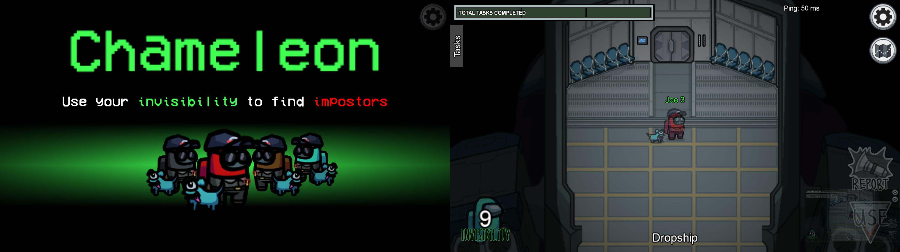

# Chameleon Mod

Chameleon Mod is a mod for Among Us that adds a new role in Among Us, the chameleon. The chameleon has the possibility to become invisible for a certain period of time. He is part of the crewmates and can use his ability to find impostors more easily.

## Installation

1. Download the latest build of BepInEx Unity IL2CPP for Windows **x86** machines available [here](https://builds.bepis.io/projects/bepinex_be).
2. Download the latest version of the mod available [here](https://github.com/Wunax/Among-Us-Chameleon-Mod/releases/latest).
3. **Optionnal**: Create a backup of your Among Us game folder (`Steam\steamapps\common\Among Us`). This backup is only useful if there is a problem in the steam installation directory of Among us, **do not** put the mod in this folder.
4. Extract the content of the BepInEx Unity IL2CPP archive to your Among Us game folder (where your `Among Us.exe` is located).
5. Extract the content of the mod archive to your Among Us game folder (where your `Among Us.exe` is located).
6. Start your game as usual.

## Usage

The host can configure the duration and cooldown of the chameleon in the lobby settings.

## FAQ

### How can I remove or disable the mod?

Delete or remove the next file from the folder: `Steam\steamapps\common\Among Us\BepInEx\plugins\ChameleonMod.dll`

### Can we play on official servers with this mod?

Currently there are no checks on the Innersloth servers, so you can play privately with your friends on the official servers. **Please do not use it in public online matches.**\
In case Innersloth implements server-side checks, I recommend that you take a look at private servers like [Impostor](https://github.com/Impostor/Impostor).

### Does everyone have to install the mod in the lobby?

Yes everyone has to install it.

### Can we play with crewlink?

Yes.

## Credits

-   Idea : [RealPonda](https://www.reddit.com/user/RealPonda/)
-   Among Us Protocol : https://github.com/codyphobe/among-us-protocol

#### Code snippets :

-   https://github.com/Woodi-dev/Among-Us-Sheriff-Mod
-   https://github.com/CheepYT/CheepsAmongUsMods
